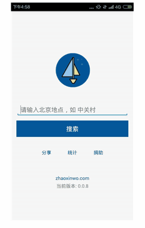

zhaoxinwo source code
===

Introduction
---

zhaoxinwo can help you search douban rental data(e.g. <http://www.douban.com/group/26926/>). Since we launched zhaoxinwo in October 2015, there are thousands of users used it. Now zhaoxinwo is open-source, including the backend services, android app and iOS app.

Deployment
---

<https://github.com/zhaoxinwo/zufang/wiki>

Source codes
---

- Backend services: <https://github.com/zhaoxinwo/zufang>
- Android app: <https://github.com/zhaoxinwo/zhaoxinwo-android>
- iOS app: <https://github.com/zhengbuqian/Zhaoxinwo>

Website
---

<http://zhaoxinwo.com>

Android
---

<http://app.mi.com/detail/83659>

iOS
---

<https://itunes.apple.com/cn/app/zhao-xin-wo/id1086589862>

License
---

MIT

[@zhangxiaoyang](https://github.com/zhangxiaoyang)
[@jiadebin](https://github.com/jiadebin)
[@zhengbuqian](https://github.com/zhengbuqian)
